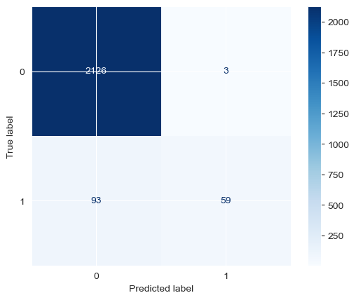
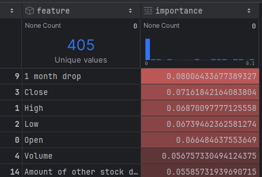

# Work in progress for now

# Idea
Everybody tells you to buy the dip, but is this actually true?

The goal of this project is to try and predict if a stock will return to its previous value within a month after a sudden drop in price. 

I know that by nature this plan is flawed and will have no actual succes. I just use it to learn some new skills:

# Random forest model


As you can see my first testing model is not great. At least its careful with its false positives.



It seems to mostly care that the drop was not too extreme this makes it a terrible predictor of actual recoveries. For now my focus is on other stuff like the flask web app.

# How it works 
This script takes in a pre-defined list of stocks. From these stocks we will get historical price data and determine when a price drop occurred. 
If a price drop is located we will check if the stock recovered after a month or not. 
From this we train a model on this data which will try and predict recoveries. 

If this works well you can use it to determine if you should just "buy the dip."

# Files used:
1. Got SP500 csv from some random place on the web

# Docker
```
docker build -t drop-recovery-predictor . 
docker run -d -p 5000:5000  drop-recovery-predictor
```

# Future ideas
1. replace close cost with high and low