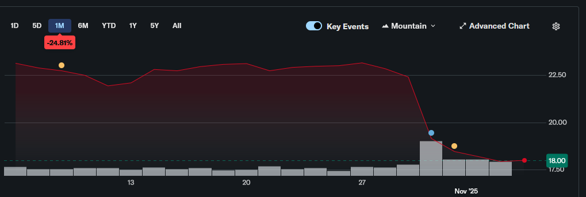

# Idea
Everybody tells you to buy the dip, but is this actually true?

The goal of this project is to try and predict if a stock will return to its previous value within a month after a sudden drop in price. 

I know that by nature this plan is flawed and will have no actual succes. I just use it to learn some new skills. 

Front end is Flask, back end is Postgress. I'm using microk8s to host it on my home server with argoCD as CD tooling.

# Random forest model


As you can see my first testing model is not great. At least its careful with its false positives.


It seems to mostly care that the drop was not too extreme. This makes it a terrible predictor of actual recoveries.

# How it works 
This script takes in a pre-defined list of stocks. From these stocks we will get historical price data and determine when a price drop occurred. 
If a price drop is located we will check if the stock recovered after a month or not. 
From this we train a model on this data which will try and predict recoveries. 

If this works well you can use it to determine if you should just "buy the dip."

# Docker
```
sudo docker build -t drop-recovery-predictor . 
docker run -d -p 5000:5000  drop-recovery-predictor
```
# K8s
See the files in the k8s directory for the deployment in k8s. Or just point ArgoCD to that dir

# Results
So far all predictors of recovery were kind of shit. Which is what I expected when I started this.
## first recovery prediction:

BAX would recover from this drop according to the debug predictor. 
Seeing a graph like this does not give me hope for it:

It's almost like I trained this prediction algo on historical data.

# Future ideas
1. replace close cost with high and low