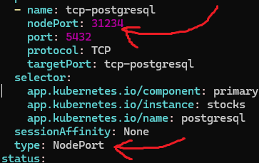

# Setting up the postgres k8s 

```
microk8s helm3 install stocks oci://registry-1.docker.io/bitnamicharts/postgresql --namespace stocks
```

Now we just need to be able to reach it from outside the cluster too, since we cant really test on my local machine otherwise.

```
microk8s kubectl edit service stocks-postgresql
```

